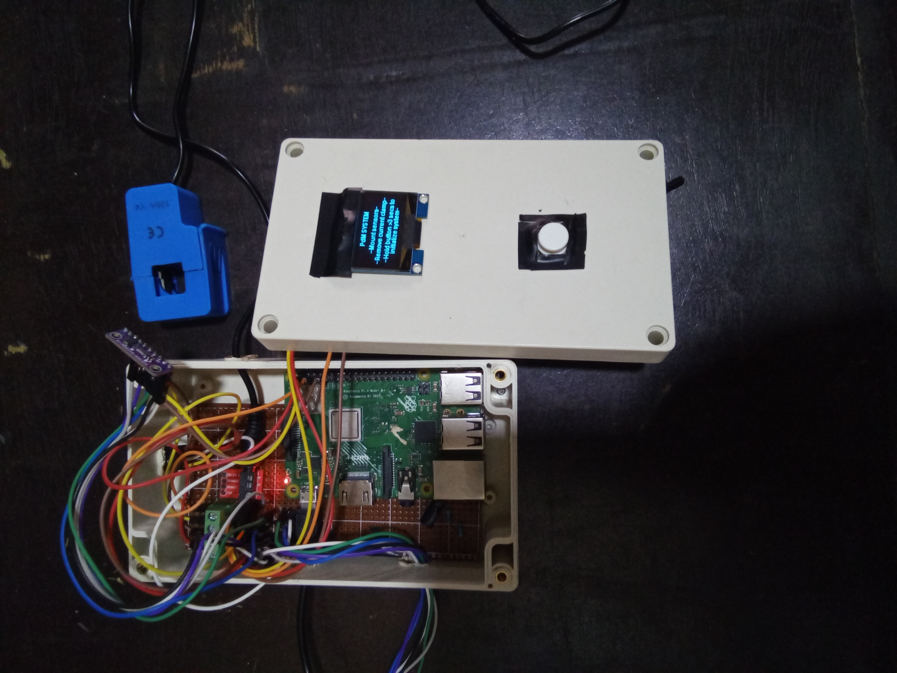

# Data-Driven Predictive Maintenance System for Electric Motors in Production Lines

A portable, low-cost edge predictive maintenance system for monitoring electric motors using current, temperature, and vibration data.

The system uses machine learning to detect motor health state, identify fault types, and estimate a continuous Health Index.

## Prototype



## System Overview

The system is designed as a portable edge device that can be temporarily attached to different electric motors in a production environment.

After connection, the system establishes a healthy operating baseline for the motor. Sensor measurements are then normalized relative to this baseline and passed to trained machine learning models.

The system provides three main outputs:

1. **Motor State** — classifies the motor as Healthy or Faulty.
2. **Anomaly Type** — identifies the detected fault condition when a motor is classified as Faulty.
3. **Health Index** — provides a continuous estimate of motor health on a 0–100 scale.

The system performs inference locally on a Raspberry Pi, allowing monitoring without relying on a continuous cloud connection.

## Hardware

The prototype was implemented as a portable edge device using:

- **Raspberry Pi 3 Model B+** — edge computing and local inference
- **SCT-013 100A/1V Current Transformer** — motor current measurement
- **ADS1115 ADC** — analog-to-digital conversion for current measurement
- **MLX90614** — non-contact temperature measurement
- **ADXL345** — three-axis vibration measurement
- **1.3-inch SH1106 OLED** — local system display
- **Push button** — user interaction and system control

### Measured Parameters

The system uses three primary sensor measurements:

| Parameter | Sensor | Purpose |
|---|---|---|
| Current | SCT-013 + ADS1115 | Monitor motor electrical behaviour |
| Temperature | MLX90614 | Monitor temperature rise |
| Vibration | ADXL345 | Monitor mechanical behaviour |

## Data Generation and Simulation

The training data was generated using a simulated electric motor system developed in MATLAB/Simulink rather than collected from a physical production motor.

The motor model was simulated under different operating and fault conditions to generate electrical, thermal, and vibration measurements representing different motor states.

MATLAB scripts were used to support the data-generation process and Health Index development.

The simulation and supporting MATLAB files are included in this repository to document the process used to generate and prepare the data for machine learning.

## Machine Learning

The system uses three separate machine learning models, each designed for a specific prediction task.

### 1. Motor State Classification

A Random Forest classifier determines whether the motor is operating in a:

- Healthy state
- Faulty state

### 2. Anomaly Classification

When a motor is classified as Faulty, a second Random Forest classifier identifies the type of anomaly from seven fault classes:

- `CurrentAnomaly`
- `VibrationAnomaly`
- `TemperatureAnomaly`
- `VibrationCurrentAnomaly`
- `VibrationTemperatureAnomaly`
- `CurrentTemperatureAnomaly`
- `MultiParameterAnomaly`

### 3. Health Index Regression

A Random Forest regression model estimates a continuous Health Index representing the motor's condition on a 0–100 scale.

### Input Features

The models use three normalized features derived from the sensor measurements:

- `Irms_ratio`
- `Vib_ratio`
- `Temp_ratio`

Each measurement is compared with the motor's healthy baseline. This produces dimensionless ratio features that describe how the motor is behaving relative to its own healthy operating condition.

## Model Performance

The final models were evaluated on held-out test data.

| Task | Model | Metric | Result |
|---|---|---|---:|
| State Classification | Random Forest | Faulty Recall | 0.997200 |
| State Classification | Random Forest | Faulty F1-score | 0.998400 |
| Anomaly Classification | Random Forest | Macro Recall | 0.958400 |
| Anomaly Classification | Random Forest | Macro F1-score | 0.958100 |
| Health Index Regression | Random Forest | MAE | 0.009512 |
| Health Index Regression | Random Forest | RMSE | 0.020585 |
| Health Index Regression | Random Forest | R² Score | 0.988378 |

The classification metrics measure the ability of the models to detect faulty operation and distinguish between anomaly classes, while the regression metrics measure the accuracy of the predicted Health Index.

## System Workflow

The system operates through the following sequence:

1. **Motor Connection**  
   The device is attached to the motor being monitored.

2. **Healthy Baseline Establishment**  
   The system establishes reference values for current, vibration, and temperature rise during healthy operation.

3. **Sensor Acquisition**  
   The Raspberry Pi continuously acquires current, temperature, and three-axis vibration measurements.

4. **Feature Normalization**  
   The measured values are converted into ratios relative to the established healthy baseline.

5. **State Classification**  
   The state model determines whether the motor is Healthy or Faulty.

6. **Anomaly Classification**  
   If a Faulty state is detected, the anomaly model identifies the corresponding fault type.

7. **Health Index Estimation**  
   The Health Index model estimates the motor's condition on a 0–100 scale.

8. **Local Display**  
   The results are presented on the OLED display for local monitoring.

## Repository Structure

```text
motor-predictive-maintenance/
├── code/
│   ├── motor_pdm.py
│   └── runtime_baseline.py
├── hardware/
│   └── Proteus circuit model.pdsprj
├── images/
│   └── prototype.jpg
├── matlab/
│   ├── datagenerationcode.m
│   ├── healthindexcode.m
│   └── motor_model.slx
├── notebooks/
│   └── complete model.ipynb
├── .gitignore
├── README.md
├── requirements.txt
└── requirements-pi.txt
```
- `code/` — Raspberry Pi application and runtime baseline logic.
- `hardware/` — Proteus circuit design for the hardware prototype.
- `images/` — Project visuals used in the README.
- `matlab/` — MATLAB/Simulink files used for motor simulation, data generation, and Health Index development.
- `notebooks/` — Data preparation, feature engineering, model training, tuning, and evaluation.
- `requirements.txt` — Python dependencies for the machine learning notebook.
- `requirements-pi.txt` — Additional dependencies required for the Raspberry Pi runtime.
- `.gitignore` — Excludes generated model artifacts and caches.
- `README.md` — Project documentation.
  
## Dataset and Reproducibility

The dataset used for model development was generated from the MATLAB/Simulink motor simulations described above.

The original generated dataset is not included in this repository. However, the relevant MATLAB and Simulink files are provided to document the data-generation process.

The `complete model.ipynb` notebook contains the subsequent data preparation, feature engineering, model comparison, hyperparameter tuning, final model training, and evaluation steps.

The trained `.pkl` models are generated as outputs of the notebook rather than being treated as source files.

## How to Run

### 1. Generate the Dataset

The dataset used for model development is generated from the MATLAB/Simulink motor simulation.

1. Open `matlab/motor_model.slx` in MATLAB/Simulink.
2. Run `matlab/datagenerationcode.m` to generate the simulated motor data.
3. Run `matlab/healthindexcode.m` to process the generated data and produce `motor_data_complete.csv`.

The generated dataset is not included in this repository.

### 2. Train and Evaluate the Models

Open:

`notebooks/complete model.ipynb`

Install the Python dependencies listed in requirements.txt, then run the notebook. The Raspberry Pi application requires the additional dependencies listed in requirements-pi.txt.

When prompted, provide the path to the generated `motor_data_complete.csv` file.

The notebook performs data preparation, feature engineering, model comparison, hyperparameter tuning, final model training, and evaluation.

The trained model files are generated as `.pkl` files by the notebook and are not included in the repository.

### 3. Run the Edge Application

The Raspberry Pi application is located in:

`code/motor_pdm.py`

The application loads the trained models and uses the connected sensors to perform local inference.

The runtime baseline logic is contained in:

`code/runtime_baseline.py`

The edge application is intended to run on the Raspberry Pi hardware described in the Hardware section.
